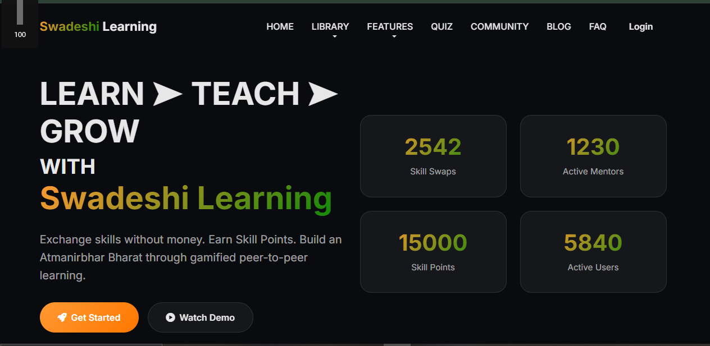
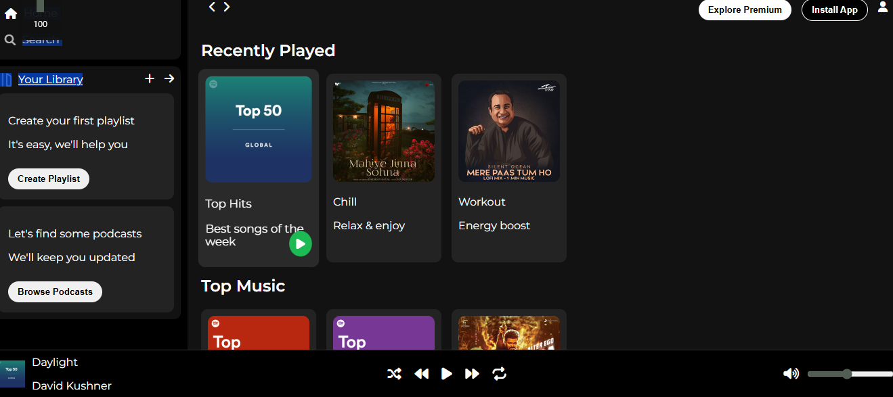

# 👋 Hi, I'm Lubna Anis

💻 B.Tech CSE Student | Full Stack Developer (MERN) in progress
✨ Building real-world web applications with impact

---

## 🌟 About Me

I’m a third-year Computer Science student at AKTU, focused on becoming a skilled Full Stack Developer.

I enjoy building practical, real-world applications that solve meaningful problems, especially in education and community-focused domains. Currently, I am preparing for internships by working on projects and strengthening my fundamentals.

---

## 🛠️ Tech Stack

💻 **Languages**
Java | JavaScript

🌐 **Frontend**
HTML | CSS | React (Learning)

⚙️ **Backend**
Node.js | Express (Learning)

🗄️ **Database**
MongoDB (Learning)

🧰 **Tools**
Git | GitHub | VS Code

---

## 🚀 Projects

### 🌐 Swadeshi Learning Platform

* Peer-to-peer learning platform for students
* Focused on accessible and community-driven education
* Enables knowledge sharing and collaborative learning
* Designed to solve real-world learning challenges

**Tech:** HTML, CSS, JavaScript *(MERN upgrade in progress)*

🔗 Repository: https://github.com/Lubna-Anis/SwadeshiLEARNING

## 📸 Project Preview

  

---

### 🎵 Spotify Clone

* Responsive music player UI
* Play/Pause and song progress tracking
* Playlist-style interface
* Interactive controls using JavaScript

**Tech:** HTML, CSS, JavaScript

🔗 Repository: https://github.com/Lubna-Anis/clone-spotify

## 📸 Project Preview

  

---

## 📈 Currently Working On

* Full Stack Development (MERN)
* Improving real-world project building skills
* Preparing for software development internships

---

## 📌 What I Bring

* Strong learning mindset and consistency
* Focus on building real-world projects
* Problem-solving approach to development
* Growing foundation in full stack development

---

## 📊 GitHub Stats

---

## 🚀 Next Goals

* Upgrade Swadeshi Learning into a full MERN platform
* Build 1–2 advanced full stack projects
* Secure a software development internship

---

## 🤝 Connect With Me  

📧 Email: lubnaanis786@gmail.com  
💼 LinkedIn: [Lubna Anis](https://www.linkedin.com/in/lubnaanis)
---

## 💫 Goal

To become a confident, skilled developer and build impactful technology solutions.
